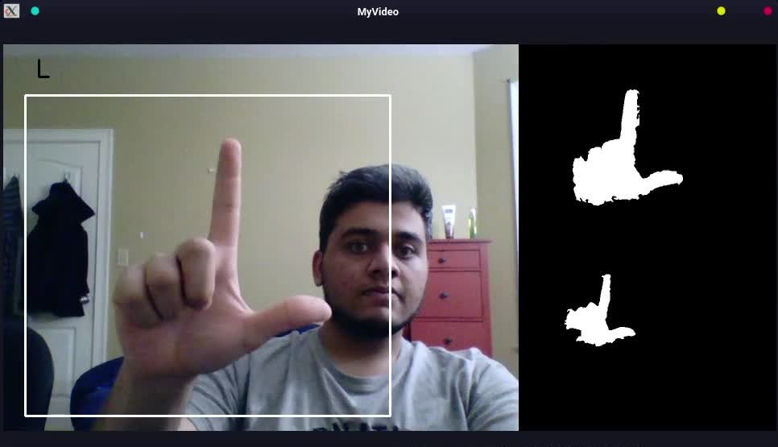
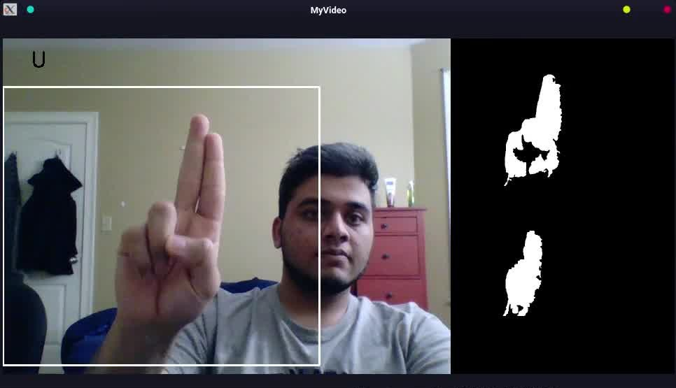
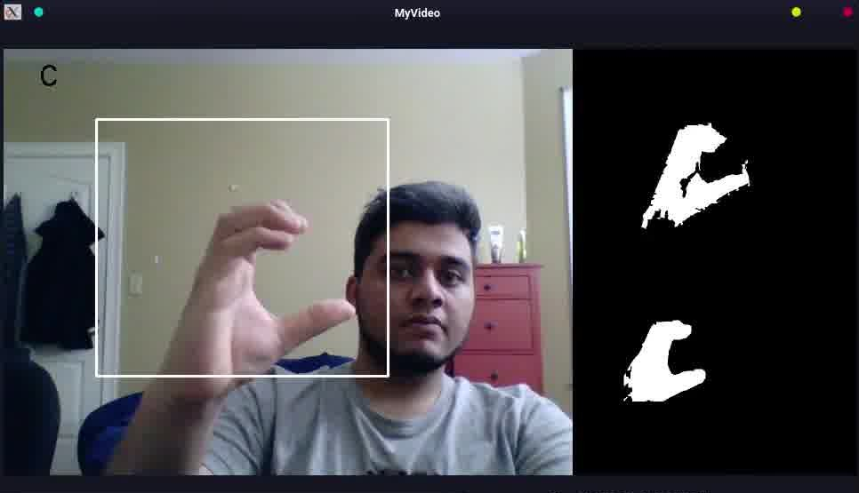
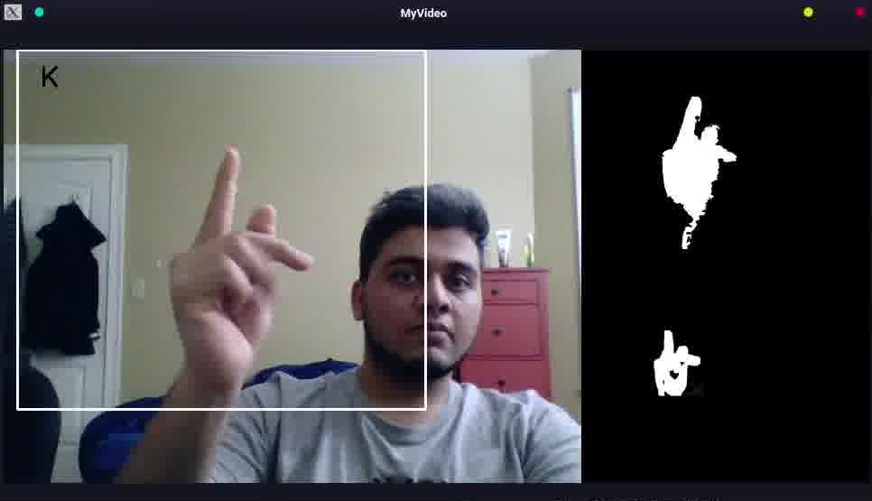

<html>
    <body>
        <h1>CS 585 HW 2 Part 2</h1>
        

            Mahir Patel
             
            Navoneel Ghosh
             
            Sherry Courington
             
            Yiwen Gu
        

        

            2021.2.17
        

        

            

            <h2>
                Overall Description
            </h2>
            

                We use computer vision techniques to recognize ASL alphabets in a video stream.
            

            

            <h2>
                Method and Implementation
            </h2>
            
Our process starts with background subtraction to perform motion segmentation. We perform median blur with kernel size 3 to remove isolated white pixels from the background. After that we perform gaussian blur and dilation of image further. Performing this step ensures that the palm which would be invisible due to small movements and background subtraction is now filled. After thresholding that image, we  merge it with skin detection algorithm so that other stationary objects detected as skin in the background are removed. The final preprocessing step is finding contours in the image and only keeping the one with the largest area. We assume that the user will keep their hands in front of their body so its area will be larger than their face. Finally, we perform multiscale template matching and display that in our UI.

            

            <h2>Experiments</h2>
            

                We created a confusion matrix from 97 frames of one of the videos of our gesture detection.
            

            

                <table>
                    <tbody>
                        <tr>
                            <td colspan="8">
                                

                                    <h3>Confusion Matrix</h3>
                                

                            </td>
                        </tr>
                        <tr>
                            <td></td>
                            <td></td>
                            <td></td>
                            <td>
                                Truth
                            </td>
                            <td></td>
                            <td></td>
                            <td></td>
                            <td></td>
                        </tr>
                        <tr>
                            <td></td>
                            <td></td>
                            <td>
                                "L"
                            </td>
                            <td>
                                "U"
                            </td>
                            <td>
                                "C"
                            </td>
                            <td>
                                "K"
                            </td>
                            <td>
                                Prediction Sum
                            </td>
                            <td>
                                Precision
                            </td>
                        </tr>
                        <tr>
                            <td></td>
                            <td>
                                "L"
                            </td>
                            <td>
                                14
                            </td>
                            <td>
                                0
                            </td>
                            <td>
                                0
                            </td>
                            <td>
                                0
                            </td>
                            <td>
                                14
                            </td>
                            <td>
                                100%
                            </td>
                        </tr>
                        <tr>
                            <td>
                                Prediction
                            </td>
                            <td>
                                "U"
                            </td>
                            <td>
                                0
                            </td>
                            <td>
                                23
                            </td>
                            <td>
                                0
                            </td>
                            <td>
                                10
                            </td>
                            <td>
                                33
                            </td>
                            <td>
                                69.69%
                            </td>
                        </tr>
                        <tr>
                            <td></td>
                            <td>
                                "C"
                            </td>
                            <td>
                                3
                            </td>
                            <td>
                                6
                            </td>
                            <td>
                                21
                            </td>
                            <td>
                                6
                            </td>
                            <td>
                                36
                            </td>
                            <td>
                                58.33%
                            </td>
                        </tr>
                        <tr>
                            <td></td>
                            <td>
                                "K"
                            </td>
                            <td>
                                0
                            </td>
                            <td>
                                0
                            </td>
                            <td>
                                0
                            </td>
                            <td>
                                14
                            </td>
                            <td>
                                14
                            </td>
                            <td>
                                100%
                            </td>
                        </tr>
                        <tr>
                            <td></td>
                            <td>
                                Truth Sum
                            </td>
                            <td>
                                17
                            </td>
                            <td>
                                29
                            </td>
                            <td>
                                21
                            </td>
                            <td>
                                30
                            </td>
                            <td>
                                97
                            </td>
                            <td></td>
                        </tr>
                        <tr>
                            <td></td>
                            <td>
                                Recall
                            </td>
                            <td>
                                82.35%
                            </td>
                            <td>
                                79.31%
                            </td>
                            <td>
                                100%
                            </td>
                            <td>
                                46.67%
                            </td>
                            <td></td>
                            <td></td>
                        </tr>
                    </tbody>
                </table>
            

             
            

                Accuracy = 74.23%
            

            

            <h2>
                Results</h2>
            

                List your experimental results.  Provide examples of input images and output
                                    images. If relevant, you may provide images showing any intermediate steps.
                 
                If your work involves videos, you can add links here, but also make
                                     sure to follow the specific homework instructions on how to submit
                                     videos.
            

            

                <image src="images/output.gif" width="640" height="480"></iframe>
            

            

                <table class="tg">
                    <thead>
                        <tr>
                            <th class="tg-0lax">L</th>
                            <th class="tg-0lax">U</th>
                            <th class="tg-0lax">C</th>
                            <th class="tg-0lax">K</th>
                        </tr>
                    </thead>
                    <tbody>
                        <tr>
                            <td class="tg-0lax"></td>
                            <td class="tg-0lax"></td>
                            <td class="tg-0lax"></td>
                            <td class="tg-0lax"></td>
                        </tr>
                        <tr align='center'>
                            The above figure shows the matching results for the 4 templates, i.e. 'L', 'U', 'C', 'K'. Each panel is composed by three images. The left (biggest) one is the frame read from webcam with matched letter showed on its top left corner if found. The top right image is the masked input frames that is used for template matching. The bottom right image in each panel is the template if found.
                        </tr>
                    </tbody>
                </table>
            

            

            <h2>
                Discussion
            </h2>
            

                <ul>
                    <strong>Strengths:
                    </strong>
                    <li>
                        Our results show that method we adopted is generally successful. We get an accuracy of 0.74
                    </li>
                    <li>
                        We scaled our input images progressively during the mathching. As a result, the algorithm will recognize a matched shape as long as the hand is view and not too small.</li>
                    <li>
                        We implemented multithreading and the we read frames from the webcam in a separate thread. As a result, our videos in the graphic display looks smoother.
                    </li>
                </ul>
                <ul>
                    <strong>Limitations:
                    </strong>
                    <li>
                        Our classifier works in normal lightening but if it is too bright or dark, errors will be introduced.
                    </li>
                    <li>
                        If the hand in the video is too small (smaller than the template resolution), the mathcing won't be detected.
                    </li>
                </ul>
                <ul>
                    <strong>Potential future work:
                    </strong>
                    <li>
                        Calculate the orientaion of the templates and objects detected, so that a certain amount of rotation can be allowed.
                    </li>
                    <li>
                        Include all the 26 alphabets and/or 10 digits to templates for matching so that we can spell anything.
                    </li>
                </ul>
                <ul>
                    <strong>Fun fact:
                    </strong>
                    <li>
                        We intentally chose our templates that says "L", "U", "C", "K". We wish all of you and ourselves good luck in the 2021.</li>
                </ul>
            

            

            <h2>
                Credits and Bibliography
            </h2>
            

                For multiple threading:
                                     https://nrsyed.com/2018/07/05/multithreading-with-opencv-python-to-improve-video-processing-performance/
                                    Opencv-python 
                                    https://opencv-python-tutroals.readthedocs.io/en/latest/

            

        

    </body>
</html>
